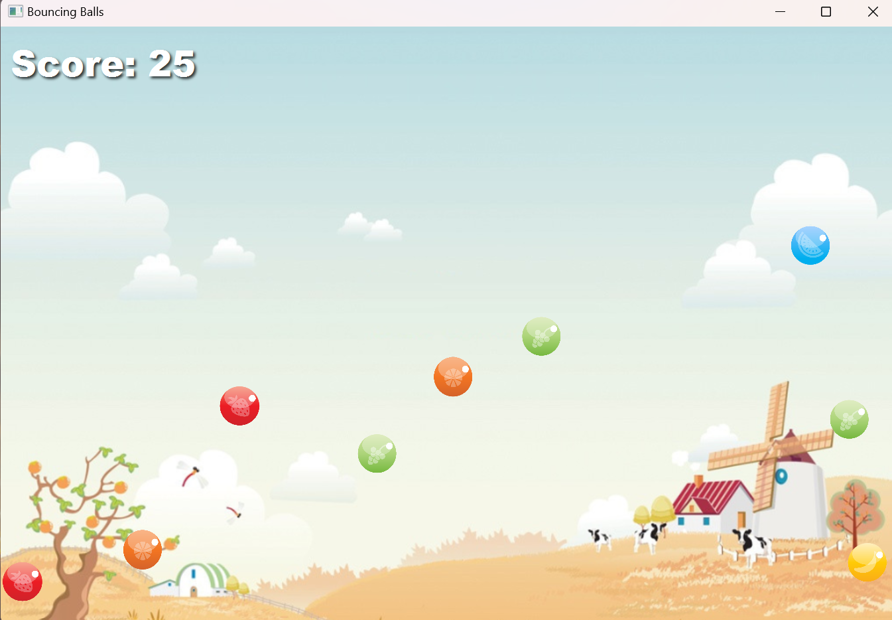

# Bouncing Balls

This is the first project coursework for CSCI2340, featuring a bouncing ball game. The user can score points by clicking to pop the bouncing balls. The faster the balls are moving, the more points are awarded for popping them. Below is a screenshot of the game.

